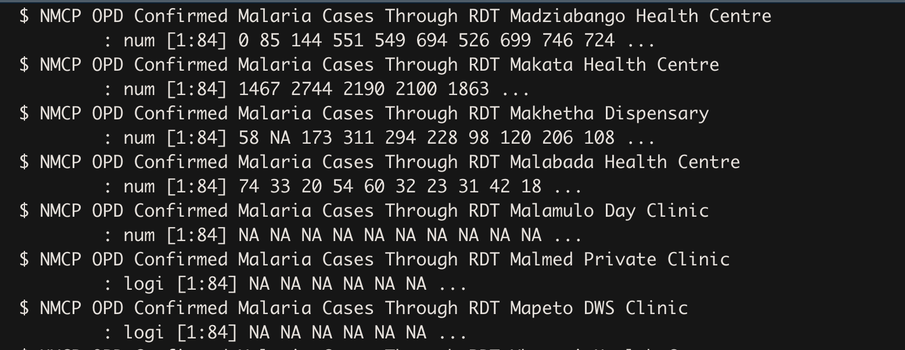

**What the script do?**

This script was developed to help cleaning of DHIS 2 data and here is the breakdown on how it manipulates raw DHIS2 data.

#----- This script helps cleaning of DHIS 2 data to be ready for joining with spatial data for health facilities across Malawi

    #-------------      Loading of data packages   ---------------------#

    library(readr)
    library(dplyr)
    library(stringr)
    library(tidyr)
    library(lubridate)
    library("tools")
    library(tidyr)
    library(ggplot2)

## Reading data files

    #-------------      Setting up a working directory -----------------#

    #setwd("~/Documents/GISFolder/Institutions/MLW/Malaria/iTPA") ## iTPA Working directory on Patrick's computer

    #-------------        Reading the data files         ---------------#

    rdt <- read_csv("inputs/DHIS2/rdt.csv") #DHS RDT 
    microscopy <- read_csv("inputs/DHIS2/microscopy.csv")#DHS Microscopy

## A snapshot of raw DHIS2 data

## Problems with DHIS2 data and cleaning procedure 

Cleaning DHIS2 data is one of the core goals of ITPA project. We first examined DHIS2 data and we recommended that first the prefix attached to facility names have to be removed (check the image above). Then the data has to be transformed from wide format to long format. Lastly, the dates have to be properly formatted.

    DHIS2cleaning <- function (outcome) {
      #Remove unnecessary columns for dates
      outcome <- outcome[, !(colnames(outcome) %in% c("periodid", "periodcode", "perioddescription"))]
      #Rename prefix
      outcome <- outcome %>% 
        rename_all(~stringr::str_replace(.,"NMCP OPD Confirmed Malaria Cases Through RDT ",""))%>%
        rename_all(~stringr::str_replace(.,"NMCP OPD Confirmed Malaria Cases Through Microscopy ",""))
      
      #rename period
      names(outcome)[1] <- "period"
      #Transform the data from wide to long
      outcome <- outcome %>% gather(facility, cases, -period)
      
      #Format facilities as a factor, not a character
      #outcome[,'facility'] <- as.factor(outcome[,'facility'])
      #Split time properly
      
      # Split period column into month and year
      outcome[c('month', 'year')] <- str_split_fixed(outcome$period, '-', 2)
      
      #drop the column period
      outcome <- within(outcome, rm(period))
      
      #Add 20 to reflect the year correctly
      outcome$pref <- "20"
      outcome$year <- paste(outcome$pref, outcome$year, sep ="")
      
      #drop prefix
      outcome <- within(outcome, rm(pref))
      
      #Combinbe date 
      outcome <- unite(outcome, date, c(month,year))
      
      #Make it a date
      outcome$date <- as.Date(paste0(outcome$date, '_1'), '%b_%Y_%d')
      outcome$date <-format(outcome$date, "%h_%Y_%d")
      
      return(outcome)
    }

## Application of the developed procedure on DHIS2 Data

The developed procedure has been applied on data that was downloaded from DHIS2 website. The cases on DHIS2 are reported based on the method that was used to confirm an infection. There are two primary methods that are used for this. These methods are: (1) the use of microscopy; and (2) RDT. We have utilized the two datasets and combined them to produce a single file for facility confirmed malaria cases.

    rdt <- DHIS2cleaning(rdt)  #--------RDT confirmed cases
    microscopy <- DHIS2cleaning(microscopy)  #--------Microscopy confirmed cases

    #------------- rename cases column to reflect the outcome measure
    names(rdt)[names(rdt) == 'cases'] <- "rdt"
    names(microscopy)[names(microscopy) == 'cases'] <- "microscopy"

    #-------------Combining RDT and microscopy data
    #In order to get the total number of cases per facility 
    #we have to combine RDT to microscopy dataset

    malaria_data <- rdt %>%
      inner_join(microscopy, by=c("facility","date"))%>%
      mutate(cases = rowSums(across(c(rdt, microscopy)))) 

    malaria_data = dplyr::select (malaria_data,-c(microscopy,rdt))

    malaria2 = malaria_data #To be replaced by combined dataset RDT and microsocopy
    malaria2$facility=as.factor(malaria2$facility)
    #
    malaria2 =spread(malaria2, date, cases)

    #Get a list of facilities on DHIS 2
    list(malaria2$facility)

    #Get a list of facilities that have no data (NA's)

    p = as.vector(colnames(malaria2))
    p = p[p!= "facility"]

## Resulting files

    #--------- Facilities that do not report data on malaria cases

    data_na <- malaria2 %>% 
      filter_at(vars(p),all_vars(is.na(.)))

    #---------- Facilities that have reported data on malaria cases

    data_no_na <- malaria2 %>% 
      filter_at(vars(p),any_vars(!is.na(.)))

    # This file CSV is to be used for joining and other operations
    DHIS2  = data_no_na

In the final data file, we have a row for each of the health facilities and columns representing each time point (months). The structure of this file will easily enable joining of malaria case data to health facilities geographical coordinates.

