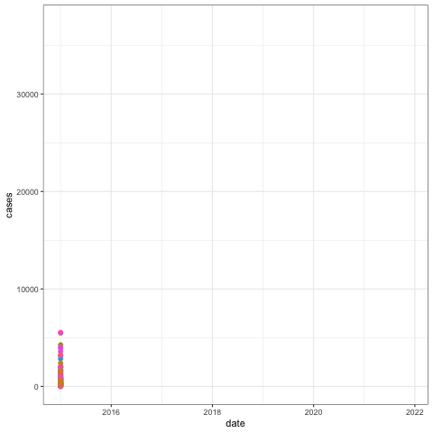

**Our data at glance**

The goal of this project was to explore mapping of malaria cases at sub-district level. We have first developed district level maps of malaria (cummulative cases and monthly cases for the entire study period).

#Add an interactive map

We have equally showed how malaria varies across districts with time.

#Add an animated graph

Based on the cases reported on DHIS , it has been observed that during the study period, majority of the malaria cases were reported in few facilities. These facilities include district hospitals such as Salima, Kasungu, Nkhotakota District Hospital, Nkhata Bay, Balaka, Mulanje, Mwanza and Machinga; rural hospitals such as Mponela and Chintheche. The full details of the cumulative cases at sub-district level has been presented in the figure below:

It is also well known that malaria is seasonal - cases of malaria peak during the rain-season and they drop during the dry-season. Irregardless of that, there are variations in malaria cases across the facilities with time. Below the changes in malaria cases with time have been visualized.

**Explaining the observed patterns?**

It is of interest to understand why some facilities report high malaria cases than others. Obviously, differences in population that is served by a facility can explain this (a facility that serve 10,000 people is expected to report more cases than a facility that serve only 100 people). But there can be more to this question. Environmental factors such as existence of permanent water bodies that sustain mosquito population can be one reason that can equally contribute to more malaria cases in one location and its absence can explain why some facilities report less cases. This list can extend to morphological characteristics such as elevation, and climatic parameters such as temperature and precipitation. The World Health Organization (WHO) indicated that malaria cases might also vary because of socio-economic factors, existence of vector control programs and accessibility of mosquito nets. In this section of the study, we intend to quantify spatio-temporal patterns of malaria cases, and model it to available environmental, climatic and socio-economic data to explain the observed patterns.

**Data resources**

| Variable                                  | Source and year | Remark |
|-------------------------------------------|-----------------|--------|
| Altitude                                  | USGS            |        |
| Temperature                               |                 |        |
| Humidity                                  |                 |        |
| Rainfall                                  |                 |        |
| Proximity to water bodies                 |                 |        |
| Land Use                                  |                 |        |
| Vector distribution                       |                 |        |
| Social demographic characteristics        |                 |        |
| Access to Anti malaria treatment          |                 |        |
| Implementation of vector control programs |                 |        |

Possible explanatory variables for differences in malaria transmission (Source: WHO)

**Model development**

Malaria cases have been estimated for each facility and month using a statistical model. We model assumes that malaria cases $Y_{ij}$ observed at a facility $i$ and year $j$ using a poisson distribution

are modeled as:

$$
   Y_{ij } {\sim} Poisson Distribution
$$

$$
   Y_{ij } {\sim} Poiss((\mu)_{ij})
$$

$$
   GLM = log link
$$

So we can present our model as below

$$
  log(\mu)_{ij}) = X_1 + X_2 + X_3 ...
$$

But we know that cases of malaria alone cannot be used to describe the general disease burden - districts have different populations. One obvious way of taking this into account is by calculating the proportion of the population that reported (such approach include the use of Standardized Morbility Ratio). However, in this work, we incorporated population as an offset, and this can be presented as below

$$
  log(\mu)_{ij}) = X_1 + X_2 + X_3 + offset
$$

Suffice to say

$$
  log(\mu)_{ij}) = X_1 + X_2 + X_3 + offset
$$

Thus if possible explanatory variables are denoted to have fixed effect $$XB$$. The model can be written as

$$
  log(\mu)_{ij}) = XB + offset
$$

#Add necessary spaces

But we also know that the cases can be affected by simply time of the year (a month that has more cases can influence other months to have more cases) or location of the facility (a location with more cases is likely to influence its neighbors to have more cases). We have added these as random effects- one to capture spatial correlation $Z_i$ and temporal correlation $Q_j$.

$$
  log(\mu)_{ij}) = XB + offset + Z_i + Q_j
$$

The modelling has been implemented using Integrated Nested Laplace Approximation (INLA) R package.

#Check related publications on quality of the presentation of the mathematical notations. Equally check with James on whether or not there are areas to improve the presentation of the modelling framework.

**Model outputs**

#Matrix definition

#MCMC

#Posterior

#Rate Ratios (Mapping them)

#Present what the model say

**Interpretation of the outputs**

#Interpret what the model say

**Use the model alone to try to predict cases**

#Come up with trendlines of malaria cases based on the factors considered

**Study strength and limitations**

The study has shown that malaria varies substantially across facilities. District level mapping can be misleading as they do not capture fine-scale patterns. This can hinder development of more targeted malaria control programs. #Difficult to find data at a resolution (spatio and temporal) equivalent to modelled unit #Poor ability of the catchment area estimation method at deducing catchments for locations with high density of health facilities (i.e. urban communities)
