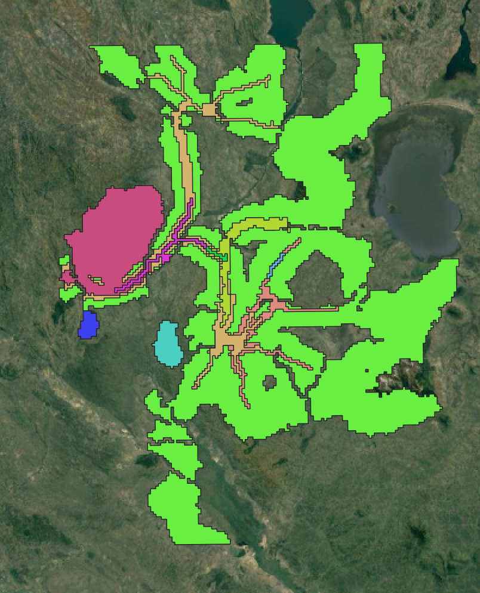

## Goal for the exercise

## Areas for potential improvement

The process for generation of catchment areas depend on friction surfaces. The existing friction surface is course (1 km by 1). There is a need to develop a fine scale friction surface. This can be produced through the use of OSM data, recent land cover map provided by ESA and topographical data from USGS. Another approach can involve using altenative approaches for estimating facility catchment areas. A good example can be World Health Organization AccessMod platform. However, in this round of attempt, AccessMod provided results that are not intuitive.

